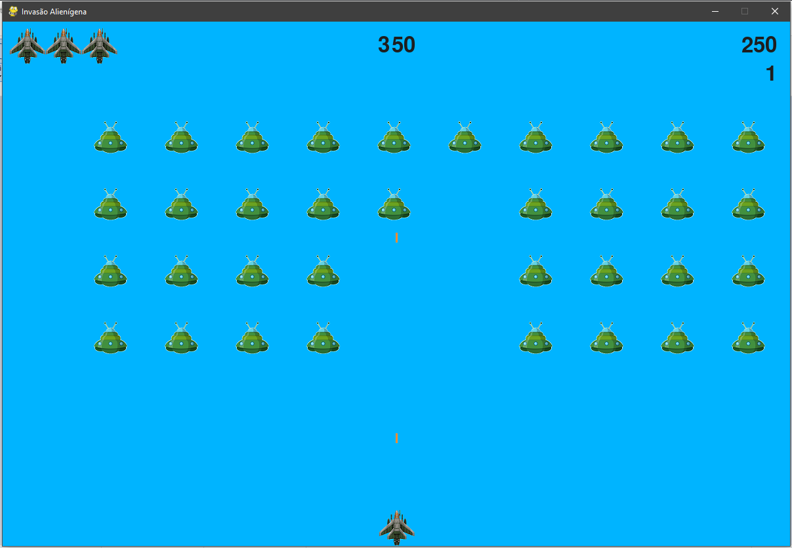

<div align=center margin= auto> 
  
</div>

# Alien Invasion

Este projeto consiste em um jogo arcade desenvolvido  a partir do livro "Python Crash Course", 
com o intuito de desenvolver habilidades em programação em Python.

## Descrição do Jogo

O objetivo do jogo é eliminar a frota de aliens que aparece no céu com uma nave espacial. O 
jogador pode mover a nave para esquerda e direita através das teclas de setas e atirar
utilizando a tecla de espaço. A frota de aliens se move de um lado ao outro da tela e para baixo,
o jogador deve eliminar todos os aliens da frota para mudar de nível. A cada nível
a movimentação da frota fica mais rápida. O jogador perde uma nave quando um alien toca o fundo 
da tela ou quando um alien toca a nave. Se o jogador perder três naves o jogo termina.

## Requisitos
- [Python](https://www.python.org/) 3.x +
- [Pygame](https://www.pygame.org/)

## Como Jogar

### Clonar este repositório utilizando os comandos abaixo:

```
$ git clone https://github.com/bryanlds/Alien-Invasion.git

$ cd Alien-Invasion
```

### Para rodar o jogo use o comando a seguir:

```
$ python alien_invasion.py
``` 
